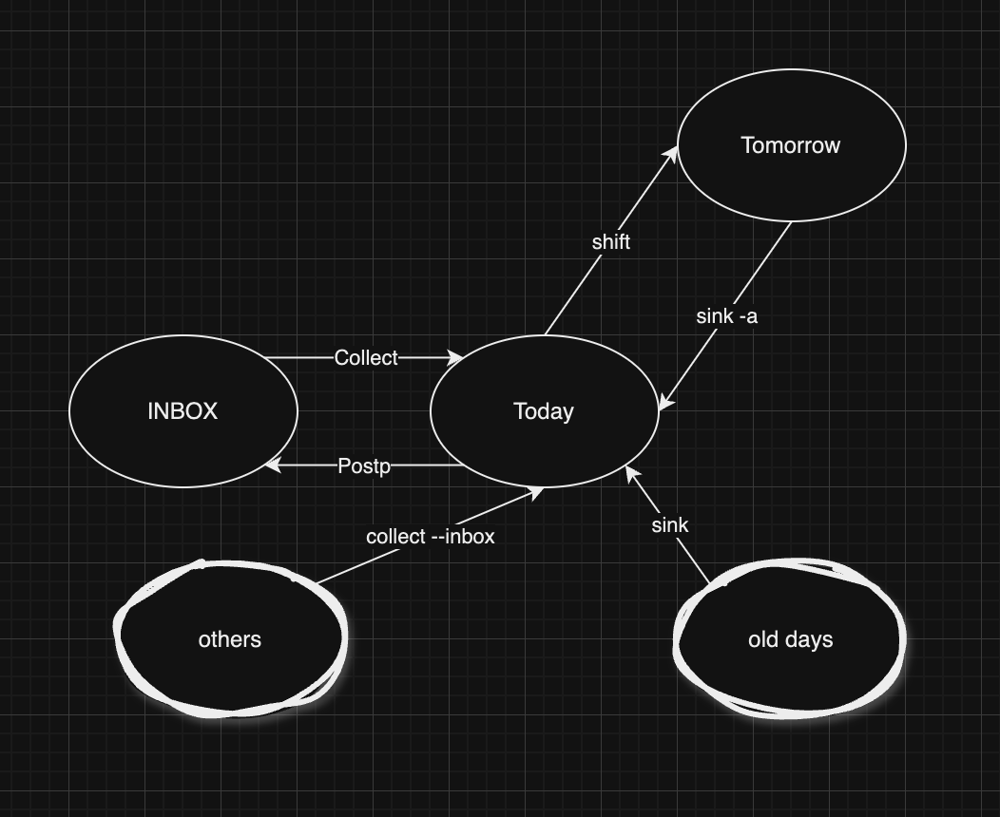

# todor - yet another cli TODO in Rust

## Design Points

- cli interface design factors:
  - add : friendly readline
  - mark: checklist with hjkl navi key support, <space> to toggle
  - edit: call vi to edit markdown file directly
  - colorful!

- how to store the tasks in fs
  - config need to go XDG_HOME_CONFIG
  - in MD, not json
  - file store at: (default) ~/.local/share/todor/*.md
  - default inbox file will be INBOX.md

- sub-tasks support
  - Use regular markdown symtax to represent sub-tasks
  - Need to use `edit` command to edit the markdown file manually to manage the level
  - `list` works very well with nice outputs
  - `mark`, `purge` can work well enough
      - but be careful about `purge --sort`
  - other commands have no changes or regressions

## Sub commands

- commands: 
  - list(default), listall, add, mark, edit, count
  - purge, glance, listbox
  - sink, shift, collect, pool
  - import
  - cleanup

  - [ ] sync with iCloud
  - [ ] sync with MS-TODO

## How the tasks are moving around

These four commands: `sink`, `shift`, `collect`, `pool` are designed to move tasks around in the list. And below is a diagram to show how they work.

