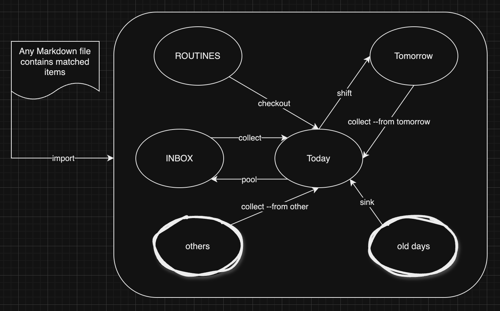

# todor - yet another cli TODO in Rust

## Usage
```
Usage: todor [OPTIONS] [COMMAND]

Commands:
  add       -> add todo item to inbox [aliases: a]
  mark      -> mark item as done [aliases: m]
  list      -> list all uncompeleted tasks in box [aliases: l, ls]
  listall   -> list all(including compeleted) tasks [aliases: la]
  listbox   -> list all todo box in working dir [aliases: lb]
  edit      -> edit todo inbox file [aliases: e, ed]
  count     -> count items in inbox [aliases: c]
  browse    -> show items in all inboxes [aliases: b]
  purge     -> purge all the duplicated lines
  sink      -> sink all outdated uncompeleted to "today"
  shift     -> shift all uncompeleted in "today" to "tomorrow"
  collect   -> collect all uncompeleted in INBOX(or --inbox <which>) to "today"
  pool      -> pooling all uncompeleted of today to INBOX
  import    -> import uncompeleted task in any markdown file to current
  cleanup   -> clean up all empty datetime taskbox
  checkout  -> checkout routine tasks to "today"(collect --inbox routine)
  routines  -> shortcut command to list all routine tasks [aliases: r, rt]
  help      Print this message or the help of the given subcommand(s)

Options:
  -c, --config <CONF>  config file
  -d, --dir <FOLDER>   working dir
  -i, --inbox <FILE>   inbox file
  -h, --help           Print help
  -V, --version        Print version

```
and with a trick: the last part of execuables' name is the task-box name, so you can create some symlinks like:
```
ln -sf todor today
ln -sf todor tomorrow
ln -sf todor t.reading
ln -sf todor todo.coding

```
which will help you to locate the corresponding task-box quickly. ("today", "tomorrow", "reading", "coding", respectively)

## How the tasks are moving around

These four commands: `sink`, `shift`, `collect`, `pool` are designed to move tasks around in the list. And below is a diagram to show how they work.



## :sparkles: Design

Many ideas were inspired by <a href="https://github.com/basilioss/mdt">mdt</a>, which is a shell script with <a href="https://github.com/charmbracelet/gum">gum</a> as the UI library. While todor is written in Rust, as a single binary with a lot of more features, meanwhile keeping the simplicity and efficiency.

- cli interface design factors:
  - add : friendly readline
  - mark: checklist with hjkl navi key support, <space> to toggle
  - edit: call vi to edit markdown file directly
  - colorful!

- how to store the tasks in fs
  - config need to go XDG_HOME_CONFIG
  - in MD, not json
  - file store at: (default) ~/.local/share/todor/*.md
  - default inbox file will be INBOX.md

- sub-tasks support
  - Use regular markdown symtax to represent sub-tasks
  - Need to use `edit` command to edit the markdown file manually to manage the level
  - `list` works very well with nice outputs
  - `mark`, `purge` can work well enough
      - but be careful about `purge --sort`
  - other commands have no changes or regressions

- Routine tasks support, please refer to [Routine Tasks](./docs/routine-tasks.md)
